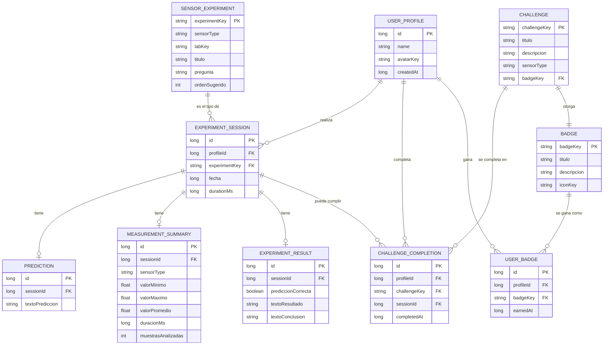

# Base de datos — Física de Bolsillo

## 1. Motor y alcance

Física de Bolsillo usa **Room** sobre **SQLite**, guardado únicamente en el
almacenamiento local del dispositivo. No existe ningún servidor, ninguna
sincronización ni ninguna copia en la nube: todo vive en el teléfono o
tableta del niño o niña, y se borra si se desinstala la app.

**Principio de diseño clave:** la base de datos guarda *resúmenes*, nunca
datos crudos de sensor ni audio. Un experimento de movimiento puede generar
cientos de lecturas por segundo del acelerómetro, pero solo se guarda una
fila con mínimo, máximo, promedio y duración. Esto evita que la base de
datos crezca sin control y respeta la privacidad del usuario.

## 2. Diagrama entidad-relación (Mermaid)

## 3. Descripción de las tablas

| Tabla | Propósito |
|---|---|
| `user_profile` | El perfil del pequeño científico o científica (nombre y avatar). |
| `sensor_experiment` | Catálogo fijo de los 17 experimentos guiados (sembrado una vez). |
| `experiment_session` | Cada vez que el usuario ejecuta un experimento. |
| `prediction` | Lo que el usuario predijo antes de medir. |
| `measurement_summary` | Mínimo, máximo, promedio y duración — nunca las muestras crudas. |
| `experiment_result` | El resultado y la conclusión mostrados al usuario. |
| `challenge` | Catálogo fijo de desafíos. |
| `challenge_completion` | Qué desafíos completó cada perfil, y cuándo. |
| `badge` | Catálogo fijo de insignias. |
| `user_badge` | Qué insignias ganó cada perfil, y cuándo. |

## 4. Por qué no se guardan muestras individuales

Un experimento de movimiento a 50 Hz durante 10 segundos genera 500 lecturas
de X/Y/Z. Guardar cada una inflaría la base de datos rápidamente sin
aportar valor educativo adicional: lo que le importa al niño o niña es el
resumen (¿se movió mucho o poco?, ¿fue más fuerte o más suave?). Por eso
`measurement_summary` guarda solo cuatro números agregados por sesión.

## 5. Privacidad del audio

El laboratorio de sonido analiza el audio del micrófono **en memoria** y
descarta cada bloque inmediatamente después de calcular su amplitud y
frecuencia dominante. Ninguna tabla de esta base de datos contiene una
columna de audio, ni existe ningún archivo de audio guardado en el
dispositivo.

## 6. Archivos relacionados

- [`database/schema.sql`](../database/schema.sql) — sentencias `CREATE TABLE` completas.
- [`database/sample_data.sql`](../database/sample_data.sql) — datos de ejemplo para pruebas manuales.
